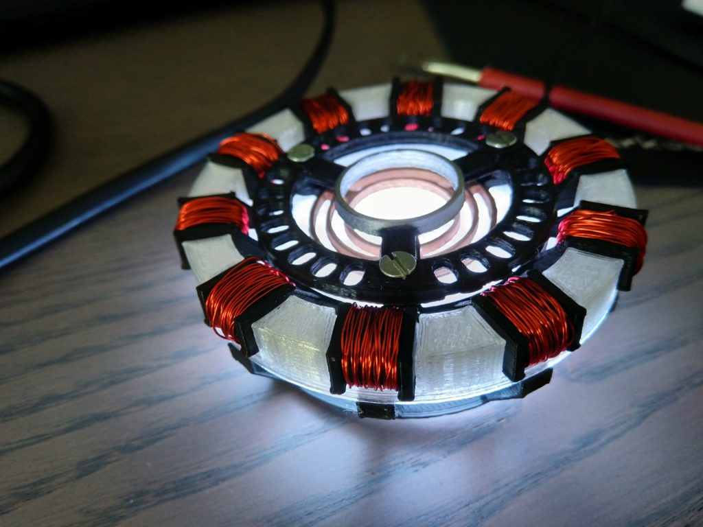
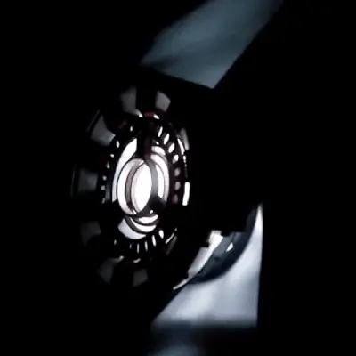
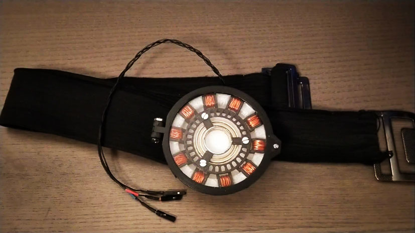
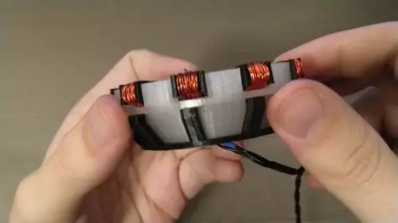

# Arc Reactor MK I | 3D Printed

This project was a succesful attempt to demonstrate how free software like __Blender__ and __Cura__ can be used for advanced 3D printing. This repository contains the __code for the animation__ of the Arc Reactor. 

  
  

Blender 2.8 was used to create the 3D model and Cura was used to create the Gcode for the 3D printer (Anycubic I3 Mega).

  
  

The LEDs are controlled by an Arduino Nano which was connected to a Powerbank.

### Components:
- NeoPixel Jewel - 7 x 5050 RGB-LED
- Arduino Nano
- 3D Model: https://www.thingiverse.com/thing:4101492
